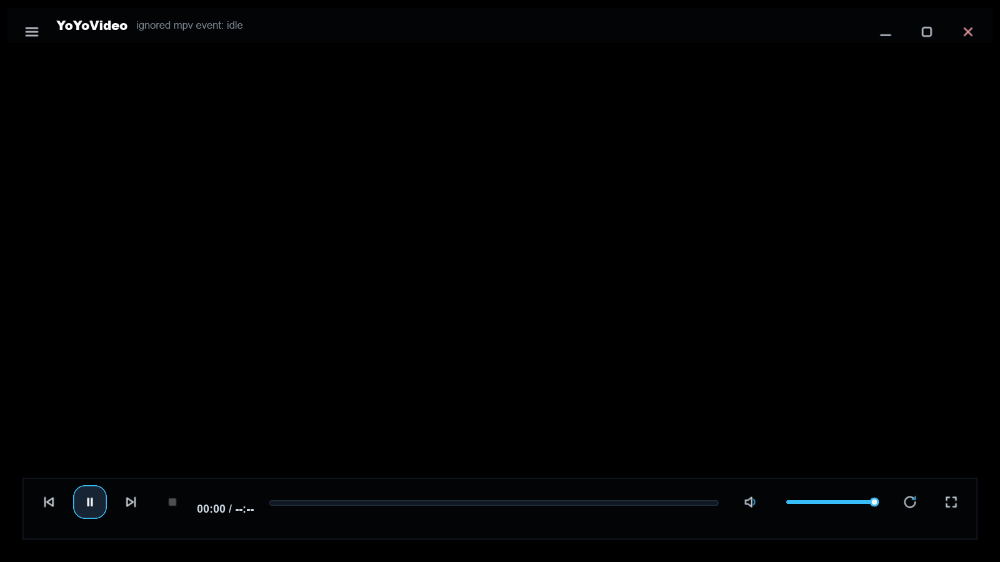

<p align="center">
  
</p>

<h1 align="center">YoYoVideo</h1>

<p align="center">
  A full-format local video player built with Rust, Slint and libmpv.<br>
  Multi-tile batch playback · subtitle and track switching · picture filters · A-B loop · fully offline
</p>

<p align="center">
  <a href="https://github.com/ijry/YoYoVideo/releases/latest"></a>
  <a href="https://ijry.github.io/YoYoVideo/"></a>
  <a href="LICENSE"></a>
</p>

---

## Interface

The window on startup. The video area is empty, and the chrome fades out a few seconds after the
pointer rests.



## What it is

A **local** video player: the interface is drawn with [Slint](https://slint.dev/) and playback is
handled by [libmpv](https://mpv.io/). It mainly exists to do one thing most players do not:
**let you watch several videos at once.**

- **Multi-tile batch playback.** Drop in several files or a whole folder; each tile is an independent
  playback session with its own transport, position and volume, and tile sizes you can drag.
- **Full transport control.** Exact time jumps, speed, zoom, rotation, picture panning, A-B loop,
  chapter jumps, and droppable markers on the timeline.
- **Subtitles and audio.** External subtitle files, adjustable delay, scale and vertical position,
  audio track switching and cycling channel modes.
- **Picture tools.** Common filter presets plus brightness, contrast and saturation.
- **A quiet frameless shell.** Self-drawn title bar and control bar, wheel for volume, hover menus.
- **Completely offline.** No network calls and no telemetry. libmpv ships inside the package, so
  **there is nothing to install first**.

See the [documentation site](https://ijry.github.io/YoYoVideo/) for the full feature and shortcut
list.

## Download

v0.0.1 ships a Windows x64 portable package and an NSIS installer. Unpack and run.

| File | What it is |
| --- | --- |
| `YoYoVideo-windows-x64-setup.exe` | Installer |
| `YoYoVideo-windows-x64.zip` | Portable package |

Grab it from [Releases](https://github.com/ijry/YoYoVideo/releases/latest); every asset carries a
SHA-256.

> **Why Windows only?** macOS has no vetted universal libmpv build and native video embedding is not
> implemented there yet; Linux would require bundling libmpv's whole dependency closure, and
> Wayland embedding is unimplemented too. See the `notes` on the matching entries in
> [`runtime/manifest.toml`](runtime/manifest.toml).

## Building from source

You need Rust stable (edition 2024). On Windows you also need the Visual Studio Build Tools C++
workload — `libmpv-sys` needs the MSVC toolchain at link time.

```powershell
# Tests: default features do not need libmpv
cargo test --workspace
cargo fmt --check

# Fetch the playback core (public upstream build, pinned by sha256)
pwsh -NoProfile -File scripts/fetch-runtime.ps1 -Platform windows-x64

# Run with real playback
pwsh -NoProfile -File scripts/dev-run.ps1

# Package
pwsh -NoProfile -File scripts/package.ps1 -Platform windows-x64 -Configuration release -RequireRuntime
```

> Use `dev-run.ps1` rather than a bare `cargo run`: `mpv-runtime` cannot be a default feature, or
> `cargo test` would fail on machines without libmpv. `dev-run.ps1` uses its own `--target-dir`,
> because a plain `cargo build` rebuilds the same binary **without** `mpv-runtime` and silently
> replaces it.

## Workspace layout

| Path | Role |
| --- | --- |
| `crates/yoyo-core` | Playback session and command logic, with **no playback core dependency** |
| `crates/yoyo-mpv` | libmpv adapter, translating core events into domain events |
| `apps/yoyovideo-desktop` | Slint desktop app, platform integration, shipped binary |
| `scripts/` | Runtime fetch, packaging, verification, smoke tests |
| `runtime/manifest.toml` | Playback core source, version and checksum |
| `docs-site/` | Documentation site (VitePress) |

There is not a single line of libmpv code in `yoyo-core`, so the whole playback domain is testable
on a machine that has never heard of libmpv — which is what makes the default `cargo test` possible.

## Contributing

Before submitting:

```powershell
cargo fmt --check
cargo test --workspace
```

CI checks that the `mpv-runtime` feature compiles on Windows, macOS and Linux. The release process is
documented [here](https://ijry.github.io/YoYoVideo/en/dev/release).

## License

YoYoVideo is released under the **GPL-3.0-or-later**; the full text is in [LICENSE](LICENSE).

The playback core bundled in release packages comes from
[`shinchiro/mpv-winbuild-cmake`](https://github.com/shinchiro/mpv-winbuild-cmake), where both mpv and
FFmpeg are **GPL-2.0-or-later**. Redistributing the binaries requires providing the corresponding
source — see [LICENSES.md](LICENSES.md) and the `LICENSES/` directory inside each package.

[中文](README.md) · [Documentation](https://ijry.github.io/YoYoVideo/en/)
